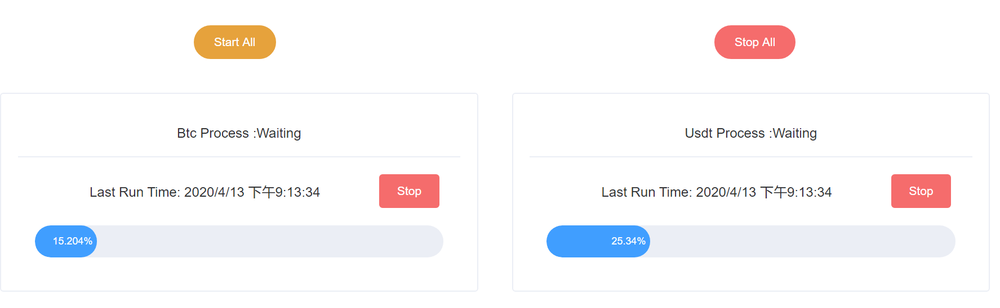
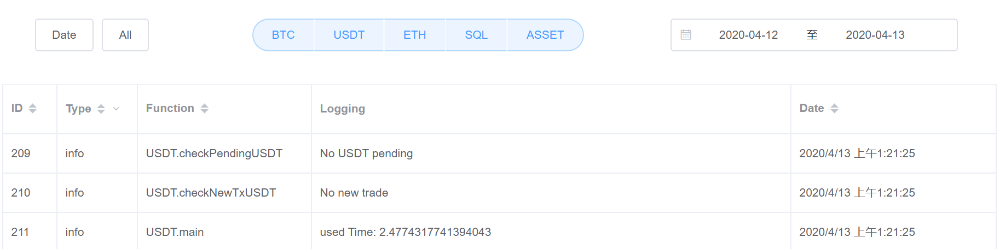
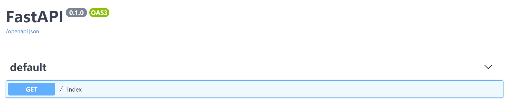

# Vue + FastApi

总体采用前后端分离的原则，通过docker自动部署
前端通过vuejs2.0实现多进程定时任务的实时监控以及可视化log列表
后端用FastApi框架+多线程控制的异步多进程定时任务

## 1.前端

### 1.1 实时监视各个进程状况+紧急结束进程

- 进程上次运行时间
- 进程目前运行状态
- 进程是否被激活

### 1.2 log可交互表格

- 日志按进程分类
- 日志类型可筛选
    - info
    - err
    - success
- 列可单独排序:
    - ID
    - Type
    - Function: 日志所在实例方法
    - Date
- 可选择日志显示日期范围

### 1.3 前端通过axios来调用后端api

## 2.后端

FastApi是一个高性能，易学，快速编码，可用于生产环境的API开发框架，不同于flask的阻塞执行模式，FastApi是异步框架。号称是最兼顾速度与效率的框架。
该框架自动 `OpenAPI` 验证和文档编制, 自动生成接口文档,集成了 `swagger`

[Benchmarks(评测)](https://www.techempower.com/benchmarks/#section=test&runid=7464e520-0dc2-473d-bd34-dbdfd7e85911&hw=ph&test=query&l=zijzen-7)

To do:
- [ ] fastapi + tortoise-orm 异步ORM
- [ ] fastapi + 用户系统 实现多人管理

## 2.1 用FastApi框架实现api接口

没什么悬念，直接：
[官方文档](https://fastapi.tiangolo.com/)

## 2.2 独立线程执行单独事件循环

FastApi本身有一个事件循环，本项目通过`新建线程`运行`新的事件循环`实现`后台` `定时` `异步` `多进程`任务:
- `BTC进程`: 检查新入账和先前pending的记录
- `ETH进程`: 检查新入账和先前pending的记录
- `USDT进程`: 检查新入账和先前pending的记录
- `SQL进程`: 接收其他进程传入的log记录
    - 该进程最早运行，最后结束，状态为一直在线
    - 所有err日志通过发送邮件通知运维
    - 所有日志按序FIFO写入到本地sqllite中
- `ASSET进程`: 检查各个用户所有的区块链地址，超过限额的自动转入冷钱包

特性：
- [x] 每个单独的进程都通过协程实现了高并发
- [x] 外部api调用时一旦出现`限流`等高危情况则立刻终止进程，同时:
    - [x] 传递进程状态给主进程的控制线程，实时反馈给前端监控界面
    - [x] 发送邮件给运维，提醒服务器ip有可能被禁
- [x] 日志通过queue在进程之间传递，过程为非阻塞

# 3.Env配置
## 3.1 Vuejs

install [nodejs](https://nodejs.org/en/)

    npm install -g @vue/cli
    # OR
    yarn global add @vue/cli

Install JS dependencies

    yarn install

element UI 

    npm i element-ui -S

start the webpack dev server:

    yarn serve

build项目

    yarn build

## fastapi

cmd
    
    uvicorn main:app --host 0.0.0.0 --port 8080 --reload

docker

    docker-compose up --build -d
